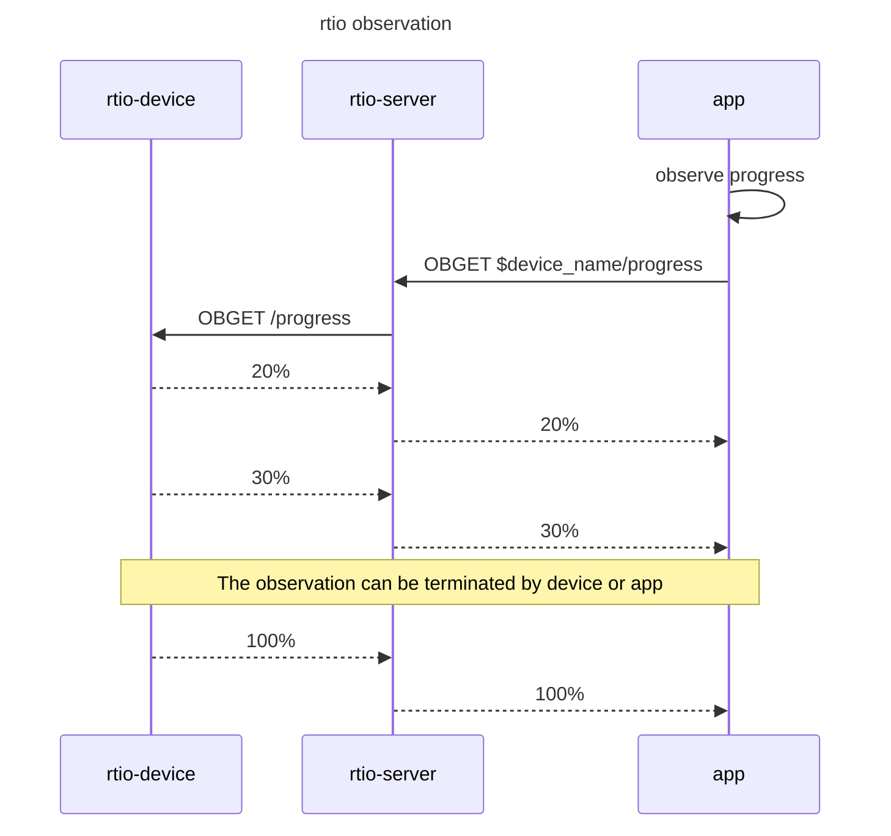

# RTIO（Real Time Input Output Service for IoT）

> **Note:**  
> This project has been moved to: <https://github.com/mkrainbow/>  
> The new RTIO project URL is: <https://github.com/mkrainbow/rtio>  
> The new RTIO API is more concise, such as registering handler functions for URIs without needing to calculate the hash first. It also adds new features, such as support for TLS and JWT authentication. Additionally, the new version does not follow the naming conventions of the current version.    
> The device SDK has been updated to include a [C SDK](https://github.com/mkrainbow/rtio-device-sdk-c), which can run on constrained devices. The [GO SDK](https://github.com/mkrainbow/rtio-device-sdk-go) has also been updated.  
> Thank you for following this project!  
>   
> **注意：**  
> 该项目已迁移至：<https://github.com/mkrainbow/>  
> 新版RTIO地址为：<https://github.com/mkrainbow/rtio>  
> 新版RTIO API更为简洁，比如给URI注册处理函数，无需先计算哈希值；同时增加了新特性，比如支持TLS和JWT验证。另外，新版本没有延续当前版面的命名方式。  
> 设备SDK，增加了[C SDK](https://github.com/mkrainbow/rtio-device-sdk-c)，可运行于受限设备。更新了[GO SDK](https://github.com/mkrainbow/rtio-device-sdk-go)。  
> 感谢您的关注！


RTIO提供设备上云的端到端解决方案，主要包括设备接入、设备代理、后端服务代理等功能：

- 用户端使用HTTP GET、POST方法通过RTIO控制和实时观察设备（通常用户端下发指令、观察设备状态）
- 设备通过GET、POST接口访问RTIO代理的资源（通常设备端获取服务端资源、上报事件）
- 用户可访问NAT网络后的设备

```text
                 native │ could
                        │     ┌───────┐     ┌──────────┐
 ┌──────────┐ tcp/tls   │     │       ├─────► device   │
 │ device   ├───────────┼─────►       │     │ verifier │
 └──────────┘           │     │       │     └──────────┘
                        │     │ RTIO  │
 ┌──────────┐ http/https│     │       │     ┌──────────┐
 │ user     ├───────────┼─────►       │     │ device   │
 └──────────┘           │     │       ├─────► services │
  phone/web/pc...       │     └───────┘     └──────────┘
```

## 特点

- REST-Like模型，其参考RESTFul模型
- 用户端通过HTTP访问设备，无需集成SDK
- 用户端通过HTTP即可实时观察设备（非轮询）
- 解耦资源实现和资源调用者（以URI标识不同资源或能力，无topic耦合）
- 单节点支持百万连接（[压测报告](./docs/stress_report.md)）

## 为什么创建RTIO

RTIO简化设备接入云端开发。设备也是服务资源的提供者，RTIO采取REST-Like模型，使设备端开发具有和WEB服务开发相似的体验和高效。主要有以下优势：

- 以URI标识不同资源或能力，比如设备提供V2/V3接口，方便设备资源或能力迭代
- 通过GET、POST和ObGet（Observe-GET）等方法交互，流程更简单（相比MQTT减少一半以上交互，可参考FQA部分）
- 解耦资源实现和资源调用者，可使用工具独立测试（类似使用curl/postman工具验证WEB服务接口）

REST-Like模型，这里指类似REST模型，但不以HTTP协议作为底层协议，模型提供了GET和POST方法和ObGET（Observe-GET，观察者模式）等方法。

RTIO交互示例可参考下文[RTIO和MQTT服务交互比较](#rtio和mqtt服务交互比较)。

## 编译和运行

环境需要安装golang（1.20版本以上）和make工具。

```sh
git clone https://github.com/guowenhe/rtio.git
cd rtio
make
```

成功编译后，out目录下会生成执行文件，主要文件如下，rtio为服务端，printer为设备端。

```sh
$ tree out/
out/

├── examples
│   ├── printer
│   
├── rtio

```

运行示例，启动rtio服务（可通过-h参数查看帮助）。

```sh
$ ./out/rtio -disable.deviceverify -disable.deviceservice -log.level=info
INF cmd/rtio/rtio.go:77 > rtio starting ...
```

另一终端启动设备，模拟打印机。

```sh
$ ./out/examples/printer
INF internal/deviceaccess/access_client/devicesession/devicesession.go:675 > serving 
```

另一终端模拟用户端，下达开始打印指令。

```sh
$ curl -X POST "http://127.0.0.1:17317/cfa09baa-4913-4ad7-a936-2e26f9671b04/post_handler" -d '{"uri":"/printer/action","id":12667,"data":"c3RhcnQ="}'
{"id":12667,"code":"CODE_OK","data":"cHJpbnQgc3RhcnRlZA=="} # 
```

模拟用户端，持续获取打印进度。

```sh
$ curl -X GET "http://127.0.0.1:17317/cfa09baa-4913-4ad7-a936-2e26f9671b04/obget_handler?uri=%2Fprinter%2Fstatus&id=12334&data=MTIzNDU%3D"
{"result":{"id":12334,"fid":0,"code":"CODE_CONTINUE","data":"cHJpbnRpbmcgNDUl"}}
{"result":{"id":12334,"fid":1,"code":"CODE_CONTINUE","data":"cHJpbnRpbmcgNDgl"}}
{"result":{"id":12334,"fid":2,"code":"CODE_CONTINUE","data":"cHJpbnRpbmcgNTIl"}}
...
{"result":{"id":12334,"fid":18,"code":"CODE_CONTINUE","data":"cHJpbnRpbmcgOTEl"}} # data部分base64解码后：printing 91%
{"result":{"id":12334,"fid":19,"code":"CODE_CONTINUE","data":"cHJpbnRpbmcgOTQl"}} 
{"result":{"id":12334,"fid":20,"code":"CODE_CONTINUE","data":"cHJpbnRpbmcgOTgl"}}
{"result":{"id":12334,"fid":21,"code":"CODE_CONTINUE","data":"cHJpbnRpbmcgMTAwJQ=="}} # data部分base64解码后：printing 100%
{"result":{"id":12334,"fid":22,"code":"CODE_TERMINATE","data":""}}
```

## 设备端集成说明

设备端代码，handler实现：

```golang
func handlerAction(req []byte) ([]byte, error) {
  log.Info().Str("req", string(req)).Msg("") 
  return []byte("print started"), nil
}

func handerStatus(ctx context.Context, req []byte) (<-chan []byte, error) {
  log.Info().Str("req", string(req)).Msg("")
  respChan := make(chan []byte, 1)
  go func(context.Context, <-chan []byte) {
  for {
    select {
    ...
    case <-t.C:
      respChan <- []byte("printing " + strconv.Itoa(progress) + "%")
    }
  }(ctx, respChan)
  return respChan, nil
  }
}
```

设备端代码，给URI注册handler：

```golang
session := ds.NewDeviceSession(conn, deviceID, deviceSecret)
 ...
 // URI: /printer/action 0x44d87c69
 session.RegisterPostHandler(0x44d87c69, handlerAction)
 // URI: /printer/status 0x781495e7
 session.RegisterObGetHandler(0x781495e7, handerStatus)

```

备注：

- 设备集成具体步骤参见[设备SDK](#设备sdk)。
- GET/POST每次交互都带有URI标识，为压缩URI数据量，设备和RTIO服务交互过程采用4字节的哈希摘要（CRC32）通信，可使用[rtio-urihash](https://github.com/guowenhe/rtio-urihash)工具计算。
- 用户端Javascript可参考：[user.html](examples/printer_simulation/user_html/user.html)。

## 设备SDK

- [rtio-device-sdk-go](https://github.com/guowenhe/rtio-device-sdk-go) 支持Golang

## 项目进展

目前完成设备端到服务端接入和Demo示例，rtio核心部分：

- HTTP远程调用设备端资源（Get、Post、ObGet）
- 设备端调用后端服务资源（Get、Post）

## FQA

1. RTIO和MQTT服务有何不同？

    他们都能与NAT后面的设备通信，MQTT为发布订阅模型，是多对多的模型，RTIO是点对点模型。

    点对点通信场景中，MQTT通常需要定义一对topic（\*_req和\*_resp）来实现请求和响应，而这对topic相关的处理函数（Handler）耦合在两个系统中。RTIO通过URI标识不同资源或能力，解耦资源实现和资源调用者。

2. 什么场景选择点对点通信？U2M（User To Machine）选择哪种模型更合适？

    “点对点通信”为两台设备间通信，“多对多通信”即多台设备间通行。“多对多”通信有多种实现模型，这里主要对比MQTT的“发布订阅”模型。

    U2M为用户端（比如手机）设备控制IoT设备，是典型的点对点通信。如果采用发布订阅作为通信模型，也可实现对IoT设备控制。但相比点对点通信会复杂许多，可参考下文“RTIO和MQTT服务交互比较”。

    另外，一个用户控制多台IoT设备，点对点通信是否适用？如果IoT设备间不进行复杂的交互（比如10台打印机之间没交互），这里用户相当于批量的对打印机控制，仅增加批量的控制逻辑（比如循环对10台打印机处理）即可，该场景点对点模型仍比发布订阅模型交互简单。

3. RTIO名字含义？

    RTIO - Real Time Input Output。“实时输入输出”，这里的“实时”指在期望的时间完成通信，否则返回超时错误。通过同步通信方式使IoT（特别是远程控制IoT设备）开发更简单。

<!-- Get可以带上body，url编解码存在不同的协议，所以统一采用body中json进行参数的处理 -->

## RTIO和MQTT服务交互比较

1. RTIO和MQTT服务交互比较，请求到云端获取version列表

    ```mermaid

    sequenceDiagram
        Title: get versions over mqtt
        participant device as mqtt-device
        participant  broker as mqtt-broker
        participant  app as app-server
        
        app ->> broker: SUBSCRIBE toppic: $diviceid_get_versins_req
        broker -->> app: SUBACK
        device ->> broker: SUBSCRIBE toppic: $diviceid_get_versins_resp
        broker -->> device: SUBACK

        device ->> broker: PUBLISH toppic: $diviceid_get_versins_req
        broker -->> device: PUBACK

        broker ->> app: PUBLISH toppic: $diviceid_get_versins_req
        app -->> broker: PUBACK

        app ->> app: query versions
        app ->> broker: PUBLISH toppic: $diviceid_get_versins_resp
        broker -->> app: PUBACK

        broker ->> device: PUBLISH toppic: $diviceid_get_versins_resp
        device -->> broker: PUBACK

    ```

    ```mermaid

    sequenceDiagram
        Title: get versions over rtio
        participant device as rtio-device
        participant  rtio as rtio-server
        participant  app as app-server(resource-server)

        rtio ->> rtio: auto discover resource and registry
        
        device ->> rtio: GET /resource/versins
        rtio ->> app: GET
        app -->> rtio: versions
        rtio -->> device: versions
    ```

2. 用户控制设备开关

    ```mermaid

    sequenceDiagram
        Title: power on over mqtt
        participant device as mqtt-device
        participant  broker as mqtt-broker
        participant  app as app
        
        app ->> broker: SUBSCRIBE toppic: $diviceid_led_power_resp
        broker -->> app: SUBACK
        device ->> broker: SUBSCRIBE toppic: $diviceid_led_power_req
        broker -->> device: SUBACK

        app ->> app: user power on
        app ->> broker: PUBLISH toppic: $diviceid_led_power_req
        broker -->> app: PUBACK

        note over app,broker : means brocker successfully received not device

        broker ->> device: PUBLISH toppic: $diviceid_led_power_req
        device -->> broker: PUBACK

        device ->> device: led power action

        device ->> broker: PUBLISH toppic: $diviceid_led_power_resp
        broker -->> device: PUBACK
        

        broker ->> app: PUBLISH toppic: $diviceid_led_power_resp
        app -->> broker: PUBACK

    ```

    ```mermaid

    sequenceDiagram
        Title: power on over rtio
        participant device as rtio-device
        participant  rtio as rtio-server
        participant  app as app

        app ->> app: user power on
        app ->> rtio: POST  $device_name/led_power
        note right of app : could set timeout
        rtio ->> device: POST /led_power
        device ->> device: led power action
        device -->> rtio: led_power status
        rtio -->> app: led_power status
    ```

3. 观察者模式（MQTT服务没有此模式）


