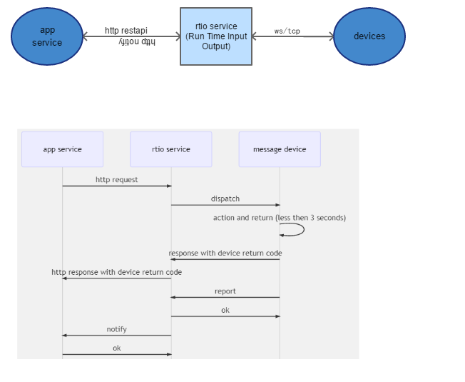
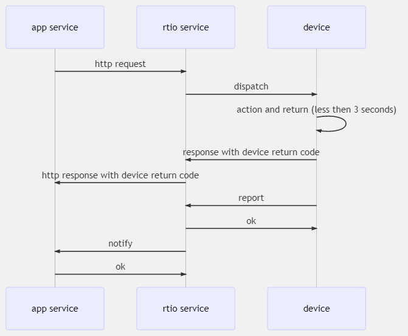
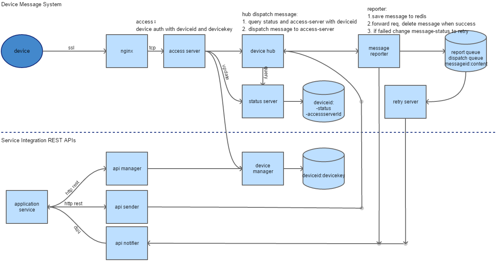

# rtio
RTIO - Real Time Input Output Services for IoT

RTIO（Real-Time Input Output）是IoT云平台中的一组服务，可轻松使用 Rest API控制和管理物联网设备，像调用函数一样调用远端设备。

RTIO Service设计以实时性和易用性为目标，比如下发消息（Rest API），传统 IoT云平台在http response仅仅表示该消息是否发到云平台，但不确定设备是否接收到（设备需要再上报一条消息作为确认）；而这里的response直接带回设备接收到消息后的响应（return code），且期望时效内没返回结果则返回错误。 

该项目采用 c/c++开发，更容易移植到边缘计算平台，比如树莓派或 beaglebone等嵌入式平台；使用zeroc ice为通信中间件，方便实现服务集群。 

## 功能和特点
    - rest api 下发消息并带回设备执行结果（远程调用设备）
    - 服务内部通信采用异步调
    - 设备到云端采用ssl通信
    - 机轻量的设备协议，相比mqtt更简单（已实现esp8266可运行demo）

## 目前不能用于生产环境
  目前设备和应用服务间的消息链路已经打通（应用服务可以远程调用设备，设备可以上报消息通知应用服务），但没有经过专门的测试，部分功能和模块还需要完善。

## 内部设计

## 还需完善
    - 重试服务
    - 消息下发接口，预期结果超过10秒的需要Notify异步返回结果
    - 设备心跳支持
    - http pipeline支持
    - 消息下发批量接口
    - 设备SDK
    - 文档完善
  
    
## 交流学习，共同完善
    欢迎大家在此交流和学习，共同进步，共同完善该项目，为“万物互联”做积极影响和贡献！
