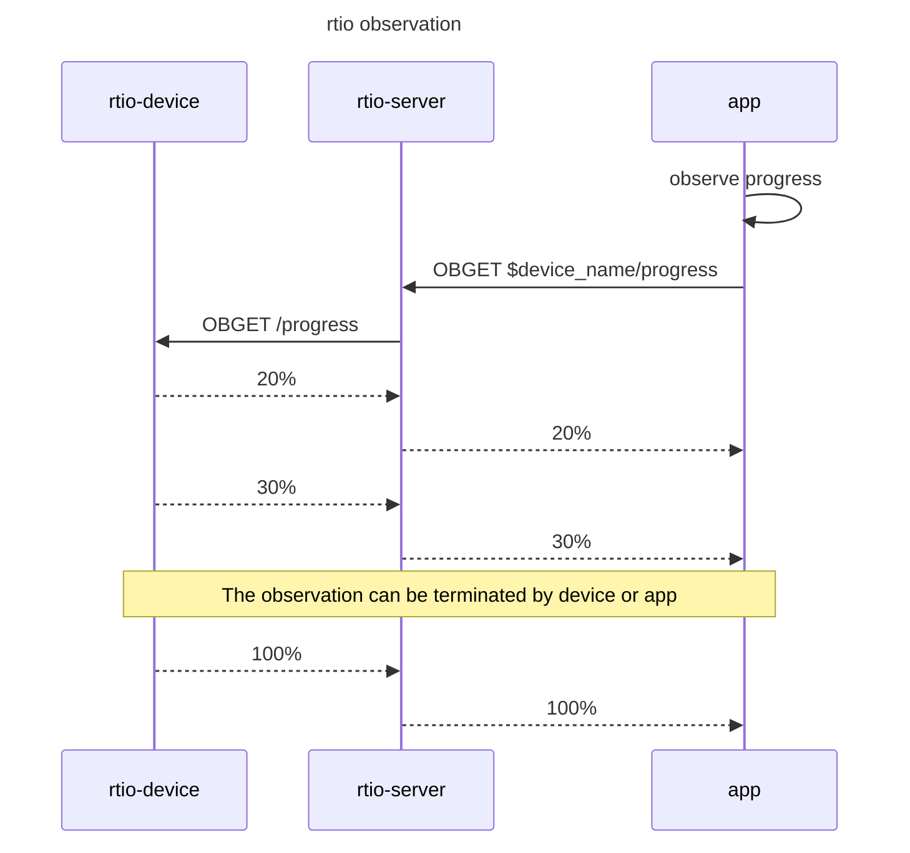

# RTIO（Real Time Input Output Service for IoT）

RTIO结合Rest（Rest-Like）模型实现物联网设备与云端通信，与MQTT服务相同的是云端可以访问NAT后面的设备，但与其“发布订阅模型”完全不同。

## 为什么创建RTIO

RTIO提供端到端的解决方案，简化设备接入云端开发。设备也是服务资源的提供者，RTIO采取Rest-Like模型，使设备端开发具有和WEB服务开发相似的体验和高效。主要有以下优势：

- 以URI标识不同资源或能力，比如设备提供V2/V3接口，方便设备资源或能力迭代
- 通过GET、POST和ObGet（Observe-GET）等方法交互，流程更简单（相比MQTT减少一半以上交互，可参考FQA部分）
- 解耦资源实现和资源调用者，可使用工具独立测试（类似使用curl/postman工具验证WEB服务接口）

Rest-Like模型，这里指类似Rest模型，但不以HTTP协议作为底层协议，模型提供了GET和POST方法和ObGET（Observe-GET，观察者模式）等方法。

RTIO交互示例可参考下文“RTIO和MQTT服务交互比较”。

## 特点

- 云端可访问NAT后设备（设备与RTIO服务建立长连接）
- Rest-Like接口
- 部署K8S集群中，可自动注册资源服务
- 用户端接入采用http和webscocket

## 安装和运行

(完善中...)

## 集成示例

设备端代码，handler实现：

```golang
func handlerAction(req []byte) ([]byte, error) {
  logger.Info().Str("req", string(req)).Msg("") 
  return []byte("print started"), nil
}

func handerStatus(ctx context.Context, req []byte) (<-chan []byte, error) {
  logger.Info().Str("req", string(req)).Msg("")
  respChan := make(chan []byte, 1)
  go func(context.Context, <-chan []byte) {
  for {
    select {
    ...
    case <-t.C:
      respChan <- []byte("printing " + strconv.Itoa(progress) + "%")
    }
  }(ctx, respChan)
  return respChan, nil
  }
}
```

设备端代码，给URI注册handler：

```golang
 deviceSession := ds.NewDeviceSession(conn, deviceID, deviceSecret)
 ...
 // URI: /printer/action 0x44d87c69
 deviceSession.RegisterPostHandler(0x44d87c69, handlerAction)
 // URI: /printer/status 0x781495e7
 deviceSession.RegisterObGetHandler(0x781495e7, handerStatus)

```

注：GET/POST每次交互都带有URI标识，为压缩URI数据量，交互过程采用4字节的哈希摘要（CRC32）进行通信。

用户接入端代码，post命令：

```golang

  req := &da.Req{
    Uri:      "/printer/action",
    Id:       id,
    DeviceId: "cfa09baa-4913-4ad7-a936-2e26f9671b04",
    Data:     []byte("{\"commnd\": \"start\"}"),
  }

  resp, err := c.Post(ctx, req)
  ...
  fmt.Println("resp:", string(resp.Data))   
```

Post相关日志

```text
设备端:
examples/device/device.go:18 > module=access_client req="{\"commnd\": \"start\"}
用户接入端:
resp: print started
```

用户接入端代码，观察status：

```golang
  req := &da.ObGetReq{
    Uri:      "/printer/status", 
    Id:       id,
    DeviceId: "cfa09baa-4913-4ad7-a936-2e26f9671b04",
    Data:     []byte("{\"policy\": \"close-when-100\"}"),
  }

  stream, err := c.ObGet(ctx, req)
  ...

  for {
    res, err := stream.Recv()
    ...
    fmt.Println(res.Id, res.Code, res.Fid, string(res.Data))
  }
```

用户接入端日志：

```log
2176192118 CODE_CONTINUE 0 printing 1%
2176192118 CODE_CONTINUE 1 printing 2%
2176192118 CODE_CONTINUE 2 printing 3%
2176192118 CODE_CONTINUE 3 printing 4%
2176192118 CODE_CONTINUE 4 printing 5%
...
2176192118 CODE_CONTINUE 96 printing 97%
2176192118 CODE_CONTINUE 97 printing 98%
2176192118 CODE_CONTINUE 98 printing 99%
2176192118 CODE_CONTINUE 99 printing 100%
2176192118 CODE_TERMINATE 100 

```

<!-- ### 运行 -->

<!-- ### docker安装 -->

<!-- ### k8s安装 -->

<!-- ## 性能 -->

<!-- ## 客户端SDK -->

## 项目进度和计划

目前仅完成设备端到服务端接入，未完成用户端接入。

## FQA

1. RTIO和MQTT服务有何不同？

    他们都能与NAT后面的设备通信，MQTT为发布订阅模型，是多对多的模型，RTIO是点对点模型。

2. 什么场景选择点对点通信？U2M（User To Machine）选择哪种模型更合适？

    “点对点通信”为两台设备间通信，“多对多通信”即多台设备间通行。“多对多”通信有多种实现模型，这里主要对比MQTT的“发布订阅”模型。

    U2M为用户端（比如手机）设备控制IoT设备，是典型的点对点通信。如果采用发布订阅作为通信模型，也可实现对IoT设备控制。但相比点对点通信会复杂许多，可参考下文“RTIO和MQTT服务交互比较”。

    另外，一个用户控制多台IoT设备，点对点通信是否适用？如果IoT设备间不进行复杂的交互（比如10台打印机之间没交互），这里用户相当于批量的对打印机控制，仅增加批量的控制逻辑（比如循环对10台打印机处理）即可，该场景点对点模型仍比发布订阅模型交互简单。

3. RTIO名字含义？

    RTIO - Real Time Input Output。“实时输入输出”，这里的“实时”指在期望的时间完成通信，否则返回超时错误。通过同步通信方式使IoT（特别是远程控制IoT设备）开发更简单。

## RTIO和MQTT服务交互比较

1. RTIO和MQTT服务交互比较，请求到云端获取version列表

    ```mermaid

    sequenceDiagram
        Title: get versions over mqtt
        participant device as mqtt-device
        participant  broker as mqtt-broker
        participant  app as app-server
        
        app ->> broker: SUBSCRIBE toppic: $diviceid_get_versins_req
        broker -->> app: SUBACK
        device ->> broker: SUBSCRIBE toppic: $diviceid_get_versins_resp
        broker -->> device: SUBACK

        device ->> broker: PUBLISH toppic: $diviceid_get_versins_req
        broker -->> device: PUBACK

        broker ->> app: PUBLISH toppic: $diviceid_get_versins_req
        app -->> broker: PUBACK

        app ->> app: query versions
        app ->> broker: PUBLISH toppic: $diviceid_get_versins_resp
        broker -->> app: PUBACK

        broker ->> device: PUBLISH toppic: $diviceid_get_versins_resp
        device -->> broker: PUBACK

    ```

    ```mermaid

    sequenceDiagram
        Title: get versions over rtio
        participant device as rtio-device
        participant  rtio as rtio-server
        participant  app as app-server(resource-server)

        rtio ->> rtio: auto discover resource and registry
        
        device ->> rtio: GET /resource/versins
        rtio ->> app: GET
        app -->> rtio: versions
        rtio -->> device: versions
    ```

2. 用户控制设备开关

    ```mermaid

    sequenceDiagram
        Title: power on over mqtt
        participant device as mqtt-device
        participant  broker as mqtt-broker
        participant  app as app
        
        app ->> broker: SUBSCRIBE toppic: $diviceid_led_power_resp
        broker -->> app: SUBACK
        device ->> broker: SUBSCRIBE toppic: $diviceid_led_power_req
        broker -->> device: SUBACK

        app ->> app: user power on
        app ->> broker: PUBLISH toppic: $diviceid_led_power_req
        broker -->> app: PUBACK

        note over app,broker : means brocker successfully received not device

        broker ->> device: PUBLISH toppic: $diviceid_led_power_req
        device -->> broker: PUBACK

        device ->> device: led power action

        device ->> broker: PUBLISH toppic: $diviceid_led_power_resp
        broker -->> device: PUBACK
        

        broker ->> app: PUBLISH toppic: $diviceid_led_power_resp
        app -->> broker: PUBACK

    ```

    ```mermaid

    sequenceDiagram
        Title: power on over rtio
        participant device as rtio-device
        participant  rtio as rtio-server
        participant  app as app

        app ->> app: user power on
        app ->> rtio: POST  $device_name/led_power
        note right of app : could set timeout
        rtio ->> device: POST /led_power
        device ->> device: led power action
        device -->> rtio: led_power status
        rtio -->> app: led_power status
    ```

3. 观察者模式（MQTT服务没有此模式）


