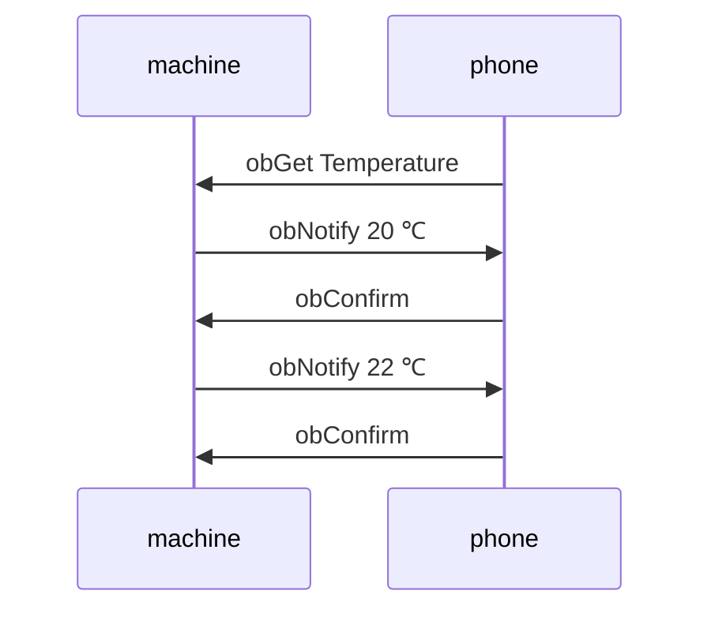
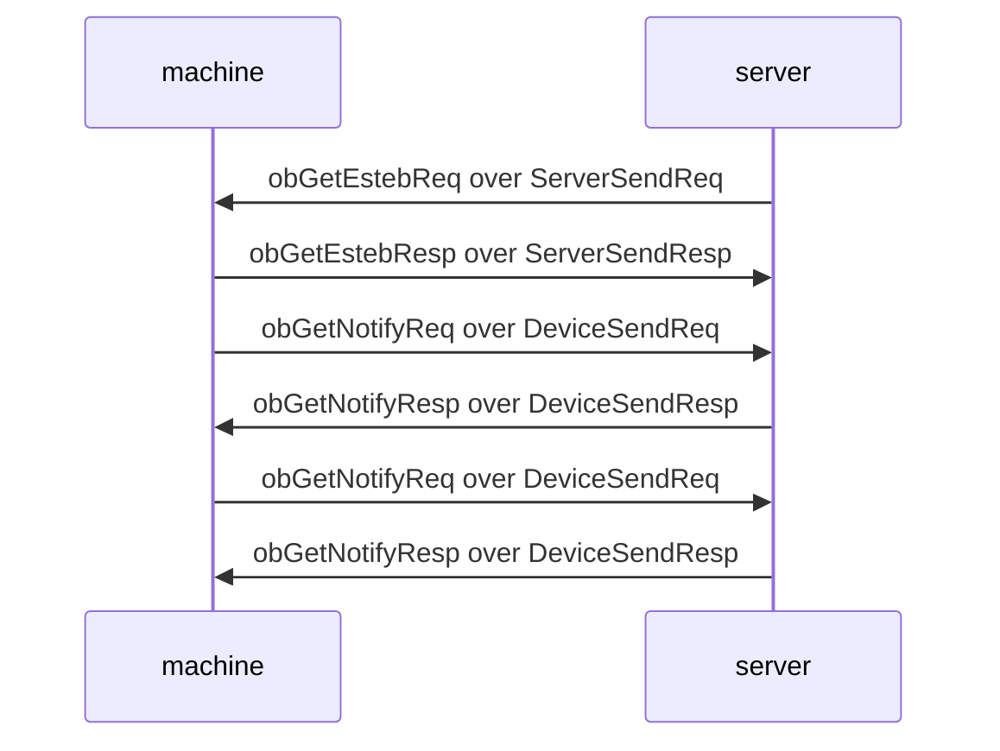

# 1. 设备接入协议

- [1. 设备接入协议](#1-设备接入协议)
  - [1.1. 消息类型](#11-消息类型)
  - [1.2. 消息格式](#12-消息格式)
  - [1.3. 设备鉴权](#13-设备鉴权)
    - [1.3.1. 请求](#131-请求)
    - [1.3.2. 应答](#132-应答)
  - [1.4. 设备心跳](#14-设备心跳)
    - [1.4.1. 请求](#141-请求)
    - [1.4.2. 应答](#142-应答)
  - [1.5. 发送消息](#15-发送消息)
    - [1.5.1. 请求](#151-请求)
    - [1.5.2. 应答](#152-应答)
  - [1.6. REST-Like通信层](#16-rest-like通信层)
    - [1.6.1 ConstrainedGet和ConstrainedPost](#161-constrainedget和constrainedpost)
    - [1.6.2 ObservedGet](#162-observedget)
  - [1.6.7. 状态码(StatusCode)描述](#167-状态码statuscode描述)
  - [1.7. 响应码(Code)描述](#17-响应码code描述)

## 1.1. 消息类型

|类型名        | 类型值 |描述        | 方向       |
|:--------------|:------|:-----------|:-----------|
|DeviceAuthReq  | 1     |设备鉴权请求 |Device -> Server |
|DeviceAuthResp | 2     |设备鉴权响应 |Server -> Device  |
|DevicePingReq  | 3     |设备⼼跳请求 |Device -> Server |
|DevicePingResp | 4     |设备⼼跳响应 |Server -> Device |
|DeviceSendReq  | 5     |发送消息请求 |Device -> Server |
|DeviceSendResp | 6     |发送消息响应 |Server -> Device  |
|ServerSendReq  | 7     |发送消息请求 |Server -> Device  |
|ServerSendResp | 8     |发送消息响应 |Device -> Server |

## 1.2. 消息格式

```text
    0                   1                   2                   3
    0 1 2 3 4 5 6 7 8 9 0 1 2 3 4 5 6 7 8 9 0 1 2 3 4 5 6 7 8 9 0 1
   +-+-+-+-+-+-+-+-+-+-+-+-+-+-+-+-+-+-+-+-+-+-+-+-+-+-+-+-+-+-+-+-+
   | Type  |V|Code |          MessageID            |          Body-     
   +-+-+-+-+-+-+-+-+-+-+-+-+-+-+-+-+-+-+-+-+-+-+-+-+-+-+-+-+-+-+-+-+
    Length         |                    Body...                    
   +-+-+-+-+-+-+-+-+-+-+-+-+-+-+-+-+-+-+-+-+-+-+-+-+-+-+-+-+-+-+-+-+
```

- V (Version): 1-bit 协议版本，当前固定值为0
- Type: 3-bit 消息类型
- Code: 3-bit 消息类型为响应（Resp）响应码，请求（Req）固定值0
- MessageID: 16-bit 消息标识，用于匹配请求和响应（同一对Req和Resp该值相同，该值为滚动生成，每请求一次自增1）
- BodyLength: 16-bit 消息体（Payload）长度（字节数）
- Body: 消息体（Payload）

以上除Body字段外为消息头（Message Header，前5字节），Body长度由Header中BodyLength字段表示。
  
## 1.3. 设备鉴权

### 1.3.1. 请求

- Header中Type为DeviceAuthReq
- Header中BodyLength为AuthData长度（字节数）加1（1字节为Device Specifics）

```text
    0                   1                   2                   3
    0 1 2 3 4 5 6 7 8 9 0 1 2 3 4 5 6 7 8 9 0 1 2 3 4 5 6 7 8 9 0 1
   +-+-+-+-+-+-+-+-+-+-+-+-+-+-+-+-+-+-+-+-+-+-+-+-+-+-+-+-+-+-+-+-+
   |CL | Reserves  |     AuthData...       
   +-+-+-+-+-+-+-+-+-+-+-+-+-+-+-+-+-+-+-+-+-+-+-+-+-+-+-+-+-+-+-+-+
```

- Body定义为以下部分
  - Specifics: 8-bit 设备属性
    - CL (Capacity Level): 2-bit Body的最大承载能力；值0表示512字节, 1表示1024字节，2表示2048字节，3表示4096字节
    - Reserves: 保留字段
- AuthData：设备ID和密钥的拼装，由“:”连接(deviceID:deviceSecret)

### 1.3.2. 应答

- Header中Type为DeviceAuthResp
- Header中MessageID必须与请求匹配
- Header中Code为响应码
- Body为空

## 1.4. 设备心跳

### 1.4.1. 请求

- Header中Type为DevicePingReq
- Header中BodyLength为0时表示默认心跳间隔300秒，否则为2（字节）

```text
    0                   1                   2                   3
    0 1 2 3 4 5 6 7 8 9 0 1 2 3 4 5 6 7 8 9 0 1 2 3 4 5 6 7 8 9 0 1
   +-+-+-+-+-+-+-+-+-+-+-+-+-+-+-+-+-+-+-+-+-+-+-+-+-+-+-+-+-+-+-+-+
   |    TimeOut (option)           |   
   +-+-+-+-+-+-+-+-+-+-+-+-+-+-+-+-+-+-+-+-+-+-+-+-+-+-+-+-+-+-+-+-+
```

- Body定义为以下部分
  - TimeOut: 16-bit 心跳发送间隔（可选），范围为30-1800秒，服务端检测超过1.5个TimeOut时⻓没收到心跳则认为客户端断开；参数设定错误，链接强制断开

### 1.4.2. 应答

- Header中Type为DevicePingResp
- Header中MessageID必须与请求匹配
- Header中Code为响应码

## 1.5. 发送消息

消息类型为ServerSendReq和DeviceSendReq的消息，用于向对方发送消息，并应答相应的响应。但一般不直接在应用层使用，作为底层传输协议。

### 1.5.1. 请求

- Header中Type为DeviceSendReq或者ServerSendReq
- Header中BodyLength为Body所承载字节数，最大值为DeviceAuthReq指定的Cap值

```text
    0                   1                   2                   3
    0 1 2 3 4 5 6 7 8 9 0 1 2 3 4 5 6 7 8 9 0 1 2 3 4 5 6 7 8 9 0 1
   +-+-+-+-+-+-+-+-+-+-+-+-+-+-+-+-+-+-+-+-+-+-+-+-+-+-+-+-+-+-+-+-+
   |    Data...  
   +-+-+-+-+-+-+-+-+-+-+-+-+-+-+-+-+-+-+-+-+-+-+-+-+-+-+-+-+-+-+-+-+
```

- Body定义为以下部分
  - Data: 发送的数据

### 1.5.2. 应答

- Header中Type为对应的DeviceSendResp或者ServerSendResp
- Header中MessageID必须与请求匹配
- Header中Code为响应码
- Header中BodyLength为Body所承载字节数，最大值为DeviceAuthReq指定的Cap值

```text
    0                   1                   2                   3
    0 1 2 3 4 5 6 7 8 9 0 1 2 3 4 5 6 7 8 9 0 1 2 3 4 5 6 7 8 9 0 1
   +-+-+-+-+-+-+-+-+-+-+-+-+-+-+-+-+-+-+-+-+-+-+-+-+-+-+-+-+-+-+-+-+
   |    Data...  
   +-+-+-+-+-+-+-+-+-+-+-+-+-+-+-+-+-+-+-+-+-+-+-+-+-+-+-+-+-+-+-+-+
```

- Body定义为以下部分
  - Data: 响应带回的数据

## 1.6. REST-Like通信层

该层向应用层提供类似REST风格的API。该层基于消息类型为DeviceSendReq和ServerSendReq及其响应，面向U2M（User to Machine）和M2S（Machine to Server）模型构成的通信层。

REST-Like Method：

|类型名        | 类型值 |描述        | 备注       |
|:--------------|:------|:-----------|:-----------|
|ConstrainedGet  | 1     |获取资源（受限模式） |支持U2M和M2S |
|ConstrainedPost | 2     |修改资源（受限模式） |支持U2M和M2S|
|ObservedGet    | 3     |获取资源（观察者模式） |仅支持U2M|

受限模式为Body大小受备Auth时指定的CL (Capacity Level)的长度。

### 1.6.1 ConstrainedGet和ConstrainedPost

请求报文：

```text
    0                   1                   2                   3
    0 1 2 3 4 5 6 7 8 9 0 1 2 3 4 5 6 7 8 9 0 1 2 3 4 5 6 7 8 9 0 1
   +-+-+-+-+-+-+-+-+-+-+-+-+-+-+-+-+-+-+-+-+-+-+-+-+-+-+-+-+-+-+-+-+
   |Method |Reserve|                                    URIDigest
   +-+-+-+-+-+-+-+-+-+-+-+-+-+-+-+-+-+-+-+-+-+-+-+-+-+-+-+-+-+-+-+-+
                   |   Data...                    
   +-+-+-+-+-+-+-+-+-+-+-+-+-+-+-+-+-+-+-+-+-+-+-+-+-+-+-+-+-+-+-+-+
```

- Method - 4-bit 请求方法。
- Reserve（Reserves） - 4 bit 保留。
- URIDigest: 32-bit 资源地址，对字符串形式的URI经过CRC32计算，得出的哈希摘要。
- Data - 请求内容。

响应报文：

```text
    0                   1                   2                   3
    0 1 2 3 4 5 6 7 8 9 0 1 2 3 4 5 6 7 8 9 0 1 2 3 4 5 6 7 8 9 0 1
   +-+-+-+-+-+-+-+-+-+-+-+-+-+-+-+-+-+-+-+-+-+-+-+-+-+-+-+-+-+-+-+-+
   |Method |Status |   Data...        
   +-+-+-+-+-+-+-+-+-+-+-+-+-+-+-+-+-+-+-+-+-+-+-+-+-+-+-+-+-+-+-+-+
```

- Method - 4-bit 请求方法。
- Status（StatusCode） - 4 bit， 参考StatusCode描述章节。
- ObservationID: 16-bit 观察ID。
- Data 携带的数据。

### 1.6.2 ObservedGet

Observe模式通常用于用户观察设备，比如连续获取传感器温度。通信过程任意一方可通过设置报文中的"Continue"为0终止交互。交互模型如下。



obGetEstebReq：

```text
    0                   1                   2                   3
    0 1 2 3 4 5 6 7 8 9 0 1 2 3 4 5 6 7 8 9 0 1 2 3 4 5 6 7 8 9 0 1
   +-+-+-+-+-+-+-+-+-+-+-+-+-+-+-+-+-+-+-+-+-+-+-+-+-+-+-+-+-+-+-+-+
   |Method |Reserve|          ObservationID        |                        
   +-+-+-+-+-+-+-+-+-+-+-+-+-+-+-+-+-+-+-+-+-+-+-+-+-+-+-+-+-+-+-+-+
    URIDigest                                      |   Data...                    
   +-+-+-+-+-+-+-+-+-+-+-+-+-+-+-+-+-+-+-+-+-+-+-+-+-+-+-+-+-+-+-+-+
```

- Method - 4-bit 请求方法。
- Reserve（Reserves） - 4 bit 保留。
- ObservationID: 16-bit 观察ID，由服务端生成。
- URIDigest: 32-bit 资源地址，对字符串形式的URI经过CRC32计算，得出的哈希摘要。
- Data - 请求内容。

obGetEstebResp：

```text
    0                   1                   2                   3
    0 1 2 3 4 5 6 7 8 9 0 1 2 3 4 5 6 7 8 9 0 1 2 3 4 5 6 7 8 9 0 1
   +-+-+-+-+-+-+-+-+-+-+-+-+-+-+-+-+-+-+-+-+-+-+-+-+-+-+-+-+-+-+-+-+
   |Method |Status |          ObservationID        |
   +-+-+-+-+-+-+-+-+-+-+-+-+-+-+-+-+-+-+-+-+-+-+-+-+-+-+-+-+-+-+-+-+
```

- Method - 4-bit 请求方法。
- Status（StatusCode） - 4 bit， 参考StatusCode描述章节。
- ObservationID: 16-bit 观察ID。

obGetNotifyReq：

```text
    0                   1                   2                   3
    0 1 2 3 4 5 6 7 8 9 0 1 2 3 4 5 6 7 8 9 0 1 2 3 4 5 6 7 8 9 0 1
   +-+-+-+-+-+-+-+-+-+-+-+-+-+-+-+-+-+-+-+-+-+-+-+-+-+-+-+-+-+-+-+-+
   |Method |Status |          ObservationID        | Data...
   +-+-+-+-+-+-+-+-+-+-+-+-+-+-+-+-+-+-+-+-+-+-+-+-+-+-+-+-+-+-+-+-+
```

- Method - 4-bit 请求方法。
- Status（StatusCode） - 4 bit， 参考StatusCode描述章节。
- ObservationID: 16-bit 观察ID。
- Data 携带的数据。

obGetNotifyResp：

```text
    0                   1                   2                   3
    0 1 2 3 4 5 6 7 8 9 0 1 2 3 4 5 6 7 8 9 0 1 2 3 4 5 6 7 8 9 0 1
   +-+-+-+-+-+-+-+-+-+-+-+-+-+-+-+-+-+-+-+-+-+-+-+-+-+-+-+-+-+-+-+-+
   |Method |Status |          ObservationID        |
   +-+-+-+-+-+-+-+-+-+-+-+-+-+-+-+-+-+-+-+-+-+-+-+-+-+-+-+-+-+-+-+-+
```

- Method - 4-bit 请求方法。
- Status（StatusCode） - 4 bit， 参考StatusCode描述章节。
- ObservationID: 16-bit 观察ID。

设备与云端通信过程如下。



## 1.6.7. 状态码(StatusCode)描述

|StatusCode |描述        |备注   |
|:---|:------------------|:------|
|0   |Unknown            |未知错误|
|1   |InternalServerError|内部错误|
|2   |OK                 |成功   |
|3   |Continue           |观察模式下用于表示继续通知|
|4   |Terminate          |观察模式下用于表示结束通知|
|5   |NotFount           |资源找不到|
|6   |BatRequest         |无效请求|
|7   |MethodNotAllowed   |方法错误|
|8   |TooManyRequests    |太多请求|
|9   |TooManyObservations|太多观察请求|

## 1.7. 响应码(Code)描述

|code |描述           |备注   |
|:----|:-----------|:------|
|0   |失败，未知原因||
|1   |成功||
|2   |消息类型错误||
|3   |鉴权失败||
|4   |参数无效||
|5   |BodyLength错误||
